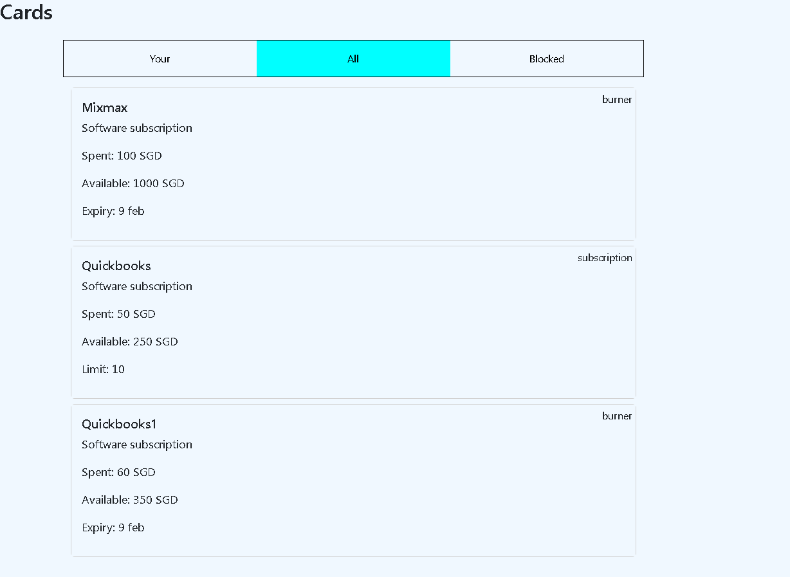

# Frontend Assignment

Deployed on [https://frontend-assignment-cards.netlify.app/](https://frontend-assignment-cards.netlify.app/)

## Instructions 

In the project directory, you can run:

### `npm install`

This will install the required packages,
after that run:

### `npm run server`

This will start a mock server to handle the data

## Next open a new terminal and run the following

### `npm start`

Runs the app in the development mode.\
Open [http://localhost:3000](http://localhost:3000) to view it in your browser.

The page will reload when you make changes.\
You may also see any lint errors in the console.

To get static bundle run:

### `npm run build` fails to minify
